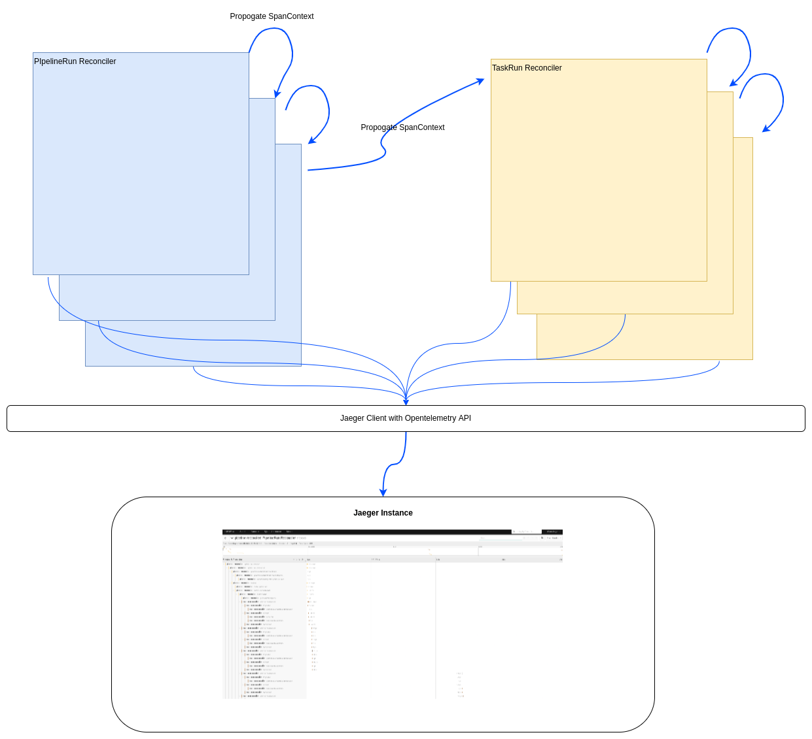
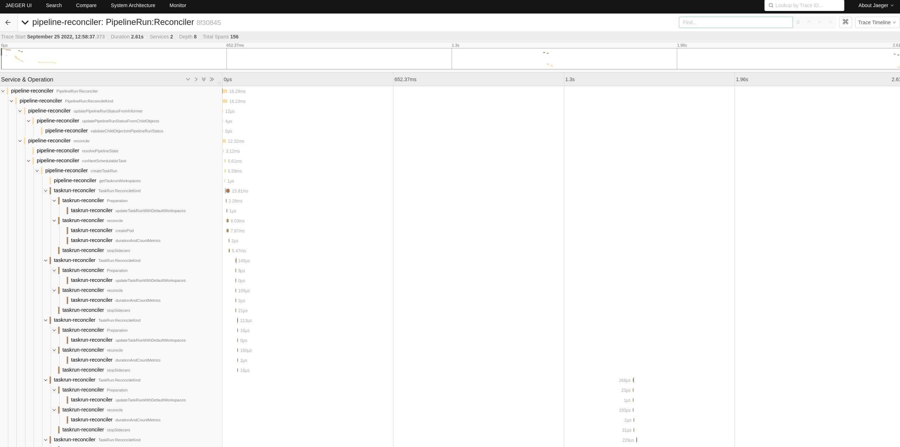

# TEP-0124: Distributed tracing for Tasks and Pipelines

<!-- toc -->
- [Summary](#summary)
- [Motivation](#motivation)
  - [Goals](#goals)
  - [Non-Goals](#non-goals)
  - [Use Cases](#use-cases)
  - [Requirements](#requirements)
- [Proposal](#proposal)
  - [PipelineRun controller](#pipelinerun-controller)
  - [TaskRun controller](#taskrun-controller)
- [Design Details](#design-details)
  - [POC](#poc)
- [Design Evaluation](#design-evaluation)
  - [Risks and Mitigations](#risks-and-mitigations)
  - [Drawbacks](#drawbacks)
- [Alternatives](#alternatives)
- [Implementation Plan](#implementation-plan)
  - [Test Plan](#test-plan)
- [References](#references)
<!-- /toc -->

## Summary

Instrument Tekton reconciler code using OpenTelemetry and Jaeger.

## Motivation

With distributed tracing, we can track the time taken by each action in the pipeline like reconciling logic, fetching resources, pulling images etc.
This allows the developers to improve the reconciliation logic and also allow end users to monitor and optimize the pipelines.

### Goals

* Implementation of opentelemetry tracing with Jaeger
* Instrumentation of pipelinerun and taskrun reconciliation logic
* Able to visualize pipeline and task reconciliation steps in jaeger

### Non-Goals

* Instrumentation of sidecars and initcontainers
* Support for more tracing backends
* Instrumentation of individual steps in each task
* Adding events to each span to indicate what is happening inside each
  method. This is an improvement task, and it can be done later once the
  basic setup for tracing is in place. The scope of this proposal is
  only to get the plumbing done by covering only the method boundaries.

### Use Cases

Pipeline and Task User:
* I would like to understand the duration of each task in my pipeline so that I can optimize the slow taks to improve the pipeline execution speed

Tekton Developer:
* I would like to understand the duration of each reconciliation step, so that I can optimize the code to improve reconciliation performance
* When the pipelines are failing due to a bug, I would like to understand which reconciliation logic caused the issue so that I can easily fix the problem

### Requirements

* Trace all functions in the PipelineRun controller
* Trace all functions in the TaskRun controller
* Support Jaeger backend
* Propagate traces so that subsequent reconciles of the same resource belong to the same trace
* Propagate traces so that reconciles of a resource owned by a parent resource belong a parent span from the parent resource
* Reconcile of different resources must belong to separate traces

## Proposal

Initialize a tracer provider with jaeger as the backend for each reconciler. The jaeger collector Base URL can be passed as an argument to the controller.

The following snippet shows how a tracing provider is initialized

```go
url := "http://jaeger-collector.jaeger:14268/api/traces"

exp, err := jaeger.New(jaeger.WithCollectorEndpoint(jaeger.WithEndpoint(url)))
if err != nil {
  return nil, err
}
tp := tracesdk.NewTracerProvider(
  tracesdk.WithBatcher(exp),
  // Record information about this application in a Resource.
  tracesdk.WithResource(resource.NewWithAttributes(
    semconv.SchemaURL,
    semconv.ServiceNameKey.String("PipelineRunReconciler"),
  )),
)
```

If jaeger collector url is not provided, the operator will continue working as before and tracing will be disabled. TracerProvider will be replaced with a no-op provider which doesn't record any spans in this case.

### PipelineRun controller
A new trace will be initialized in the pipelineRun controller when a new PipelineRun CR is created. The span context will be propogated through the reconciliation methods
to instrument the actions and steps included in the reconciliation logic. The span context will be saved back to the PipelineRun CR as an annotation `tekton/pipelinerun-span-context`. This span context can
be retrieved during the next reconciliation loop for the same CR. This way, we will have a single parent span for the entire reconciliation logic for a single PipelineRun CR. This makes it easy to visualize
the multiple reconciliation steps involved for each PipelineRun.

When a TaskRun is created by the PipelineRun reconciler, the parent span context is passed as an annotation `tekton/taskrun-span-context` so that TaskRun reconciler use the same span as its parent.

### TaskRun controller
TaskRun reconciler retrieves the parent span context propogated by PipelineRun controller. If it is not present (TaskRun is created by user in this case), a new span will be created. It will be used to 
instrument the logic similar to PipelineRun controller.
The spancontext should be also made available as environment variables containers (using downward api) running the tasks. So that the task containers can continue the span if it supports it.

## Design Details

The high level flow of a trace is shown in the diagram below



### POC

A POC was developed to check the feasibility of the implementation. It can be found [here](https://github.com/kmjayadeep/pipeline/tree/opentelemetry-poc)

A trace from PipelineRun looks like the screenshot below.



## Design Evaluation

There is no change to API involved. Enabling tracing is completely optional for the end-user. If tracing is disabled or not configured with correct tracing backend URL,
the reconcilers will work as usual. Hence we can consider this as a non-breaking change.

### Risks and Mitigations

We have to make sure not to include any sensitive information as part of
the traces. The scope of this proposal is only to do the plumbing part,
but we need to consider the security aspect when reviewing PRs related
to this in the future.

### Drawbacks

The change involves adding a new attribute to `Reconciler` struct for `PipelineRun` and `TaskRun`. It is required to initialize new tracer providers per reconciler.

## Alternatives

The alternative approach is to directly use Zipkin or Jaeger SDK instead of OpenTelemetry. Using OpenTelemetry makes it easy to switch between providers, without changing the code.

## Implementation Plan

The changes are non-disruptive and doesn't involve changes to any
reconciliation logic. So a single PR is sufficient to include all the
changes mentioned in this proposal.

### Test Plan

There must be unit tests for recording of spans and e2e tests for context propogation through custom resources.

## References

* [Instrument Tekton resources for tracing](https://github.com/tektoncd/pipeline/issues/2814)
* [OpenTelemetry](https://opentelemetry.io/)
* [OpenTelemetry instrumentation in GO](https://opentelemetry.io/docs/instrumentation/go/manual/)
* [Jaeger Tracing](https://www.jaegertracing.io/)
